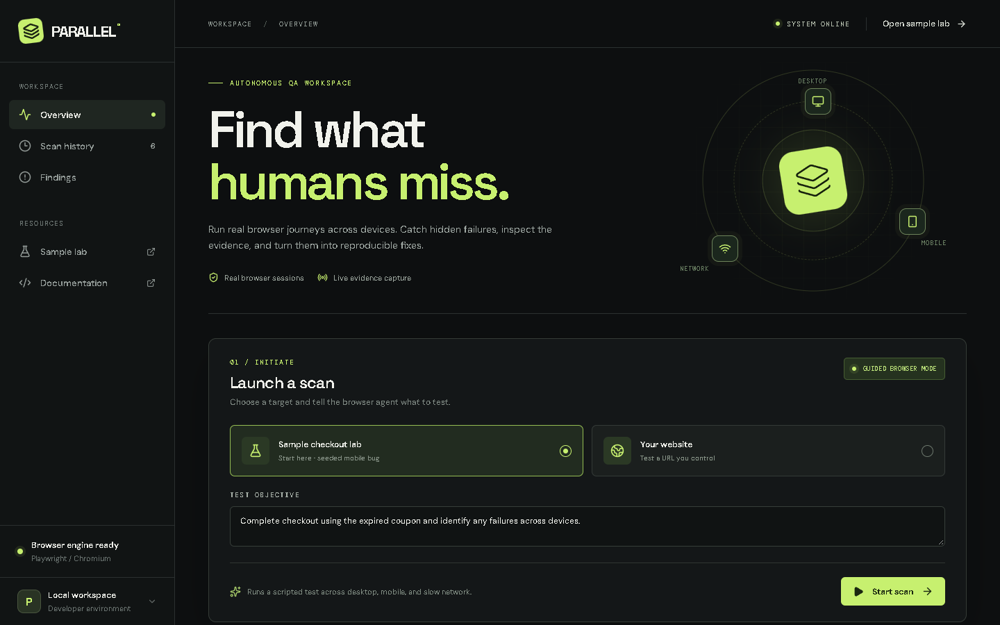

# PARALLEL

PARALLEL is a local AI browser testing lab. It runs real Chromium sessions across desktop, mobile, and a delayed network profile, stores Playwright traces and screenshots, and presents failures with the browser actions that produced them.

The included sample checkout has an intentional bug: an expired coupon returns a normal validation message on desktop but HTTP 500 on mobile. A complete scan should show **desktop passed, mobile failed, slow network passed**.



[Mobile dashboard view](docs/mobile.png)

## Hosted preview

The Vercel deployment shows the dashboard and a working sample store. Browser scans are available from the local app only. The hosted dashboard labels this clearly and links to the sample store; its scan API returns HTTP 501 instead of pretending to start a run. A cloud scan service would need a persistent browser worker and durable artifact storage.

## Run locally

Requires Node.js 22+.

```powershell
npm ci
npx.cmd playwright install chromium
npm.cmd run dev
```

Open `http://127.0.0.1:3000`, select **Sample checkout lab**, then click **Start scan**. On macOS or Linux, use `npx` and `npm` without `.cmd`.

The test environment is at `http://127.0.0.1:3000/lab/checkout`. No payment or real order is created.

To verify the complete scan from the command line while the app is running:

```powershell
npm.cmd run verify:local
```

## Optional AI exploration

Copy `.env.example` to `.env.local` and set `OPENAI_API_KEY`. You can change `OPENAI_MODEL` to a model available to your account. Restart the app after updating the file.

With a key, PARALLEL asks the model to choose actions from visible page controls for custom targets and generates an evidence-limited diagnosis. Without a key, custom targets receive a same-origin guided link crawl. The sample lab always uses a reproducible scripted journey so its result can be checked consistently.

No key is required for the sample lab. API credentials are read on the server and are never sent to the browser. Model-guided exploration was designed for test environments; do not point it at a live payment or messaging flow.

## What the dashboard reports

- Browser profile status, actions, and activity log
- HTTP failures and uncaught page errors
- Full-page screenshots and downloadable Playwright traces
- A source-aware diagnosis, proposed code change, and regression test for the included lab
- An AI hypothesis for custom-site failures when a model key is configured

The proposed lab change is **not applied or verified** by the app. For custom sites, PARALLEL does not inspect repository source or open pull requests yet. A completed profile means the chosen journey finished without a captured HTTP error or uncaught exception; it is not a claim that the entire site is bug-free.

## Architecture

```text
Next.js dashboard → /api/runs → local scan runner
                                   ├─ Playwright: desktop
                                   ├─ Playwright: mobile
                                   └─ Playwright: delayed network
                                      ↓
                              events + findings + artifacts
                                      ↓
                        .parallel/runs + .parallel/artifacts
```

Scans run in the local Next.js process. This app is intended for a persistent local or self-hosted Node server; a serverless deployment needs a separate durable browser worker and artifact storage. Scan metadata is saved under `.parallel/runs`. Screenshots and traces are saved under `.parallel/artifacts` and served through a read-only API route. The `.parallel` directory is gitignored.

## Development

```powershell
npm.cmd run typecheck
npm.cmd run format:check
npm.cmd run build
```

The GitHub Actions workflow installs Chromium, builds the app, and runs the end-to-end lab scan.

## License

MIT
